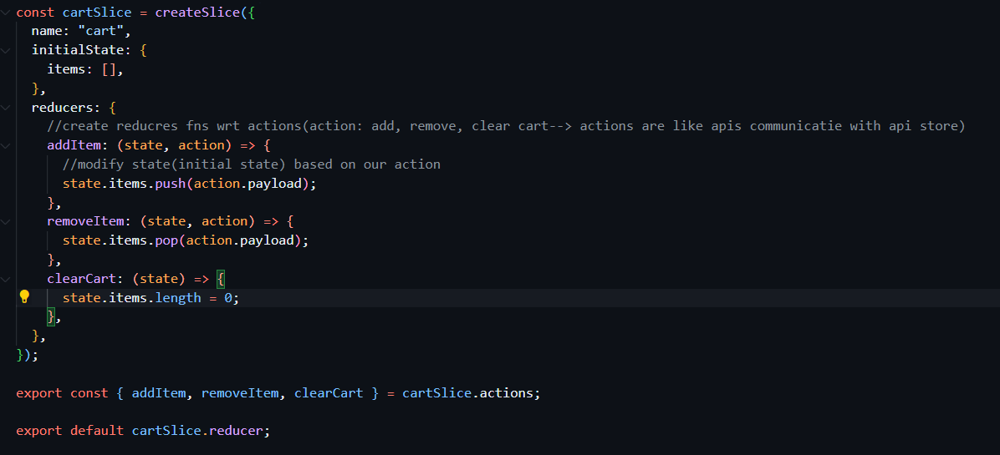

### Build our own REDUX STORE

- How to manage state of application
- Howto manage data layer of our application
- React works in UI layer of react app
- Redux works in Data Layer of react app

- Using redux from start is not mandatory along with react from start of building the application

- Redux is used when lots of data is transferred between components or if there are more read and write operations
- All the applications built with redux can also develp with out redux

- Redux is not a part of react , redux is seperate library , which we install in our project and we use in our project
- Redux is not the only library that we use for state management there are other libraries too , which do the same thing
- **Zustand** --> another library use for state management

- Redux offers easy debugging

#### Other Libraries from the Redux Team

- React-Redux --> Official React bindings for Redux
- Redux Toolkit --> Toolset for redux development

### Architecture Of REDUX ...Scenes behind Redux ToolKit

- REDUX STORE IS LIKE A BIG JS OBJECT KEPT IN A GLOBAL CENTRAL PLACE
- Is it good to keep all the data in the one big object? YES

  - we can make slices of the redux store
    - Slice is a small portion of redux store
      - Examples : To keep data seperate we make logical seperations --> slices
        - Card data slice, user data slice, themes data slice...

- Suppose if we want to add an item to cart, we cant directly sent to card
  - There is a process
    - When user clicks add button it **"DISPATCHES AN ACTION"**
    - And calls a **FUNCTION** , This function (reducer function) will internally modify the cart
      - it will updates the slice of the redux store
      - This function is basically known as **REDUCER**
      - The whole above process is writing the data
    - How to read the writtedn data?
      - We use the **SELECTOR** to read the data, and selector will give the data
      - When we use the selector , it is known as **SUBSCRIBING TO THE STORE** (It means , it is SYNC with the store)
- To connect redux store with react , react the app with < Provider store={appstore}> .......app... </Provider>

- Now we will create slices (cart slice) -
- 
- And then create reducers with state and action , payload is the data
- **Dispatch an Action**
-       const dispatch = useDispatch();
        const handleClearCart = (cartItems) => {
        dispatch(clearCart(cartItems));
        };
  **IMPORTANT**
- _whenever we are using useSelector , make sure you are using the right portion of the store_
-         const cartItems = useSelector((store) => store.cart.items); //subscribing to store using selector

- Whenever anything changes in the store, and if the whole store is subscribed , then the component will be effected , so it is less performace

- Always subscribe to the small part of the store , for better performnace

- OlderRedux => Never Mutate the state and returning was kind of mandatory
- ReduxToolKit => You have to mutate the state ...returning is not mandatory

- Redux behind the scenes uses "IMMER"
- IMMER --> Takes the exisiting state and take the new state amd calcualte the differnece and gives the new state to the redux
- Redux Tool kit --> either mutate the exiasting state or return the new state(replace whatever there in original state)
